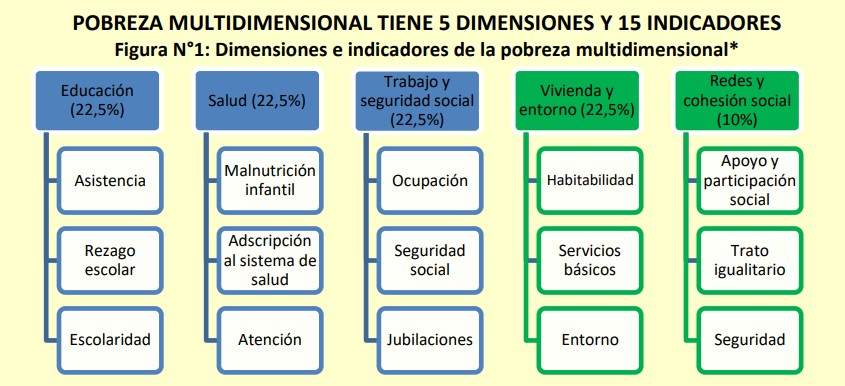

Isabel Molina Peralta
Facultad de Ciencias Matemáticas
Departamento de Estadística e Investigación Operativa
isabemol@ucm.es


```{r 1, message=FALSE, warning=FALSE, include = FALSE, echo = FALSE}

#suppressWarnings(library(RODBC))

library(ggplot2)
library(ggpubr)
library(markdown)
library(shiny)
library(shinythemes)
library(tidyverse)
library(magrittr)
library(lubridate)
library(plotly)
library(xts)
library(dygraphs)
library(kableExtra)
library(knitr)
library("readxl")
library(rsconnect)
library(dplyr)
library(summarytools)
library(epiDisplay)
library(leaflet)
library(haven)
library(epiDisplay)
library("readxl")
library(expss)
library(hrbrthemes)
library(viridis)
library(viridisLite)
library(DescTools)
library(roperators)
library(shinycssloaders)
library(writexl)
library(labelled)
library(tidyverse)
library(haven)
library(readr)
library(sjmisc)
library(WriteXLS)
library(ineq)
library(readstata13)
library(reldist)
library(DT)
library(dplyr)
library(kableExtra)
library(ggplot2)
library(sf)
```

<style>
.scrollable-table {
    overflow-x: auto;
    overflow-y: auto;
    height: 300px;
    width: 800px;
    border: 1px solid #ddd;
    padding: 10px;
}
</style>

</br>

```{r 3, message=FALSE, warning=FALSE, include = FALSE, echo = FALSE}
# update.packages(ask = FALSE)
```


# Introducción

La pobreza es un fenómeno multidimensional que afecta diversos aspectos de la vida de las personas, incluyendo su acceso a recursos básicos, educación, salud y vivienda. En Chile, la medición y análisis de la pobreza han sido fundamentales para el diseño de políticas públicas orientadas a mejorar la calidad de vida de la población más vulnerable. Sin embargo, estas políticas a menudo no han abordado los problemas de desigualdad estructural que subyacen a la pobreza.

El análisis de clases sociales es crucial para entender cómo la pobreza y la desigualdad se distribuyen y perpetúan en la sociedad chilena. Las clases sociales, definidas por factores como el ingreso, la ocupación y el nivel educativo, influyen significativamente en las oportunidades y recursos disponibles para los individuos. En este contexto, la pobreza no solo se manifiesta como una falta de recursos económicos, sino también como una limitación en el acceso a oportunidades que permiten mejorar la calidad de vida.

Este estudio se centra en la distribución geográfica de la pobreza en Chile, utilizando datos del Censo 2017 y la Encuesta de Caracterización Socioeconómica Nacional (Casen) 2022. El Censo 2017 proporciona una base sólida para entender la distribución demográfica y socioeconómica de la población chilena, mientras que la Casen 2022 ofrece una visión actualizada y detallada de las condiciones de vida y los niveles de pobreza en el país. Creemos que al integrar estos dos conjuntos de datos, es posible realizar un análisis geoespacial que permita identificar patrones y tendencias en la distribución de la pobreza.

Este artículo tiene como objetivo principal explorar cómo la pobreza se distribuye geográficamente en Chile. Para ello, la información de pobreza proporcionada por la Casen se ajustará con un indicador de vulnerabilidad a la pobreza por manzana utilizando datos censales. Esta metodología permitirá visualizar y cuantificar las disparidades en la incidencia de la pobreza con un alto nivel de detalle geográfico.

Los resultados de este estudio no solo contribuirán al conocimiento académico sobre la pobreza en Chile, sino que también ofrecerán información valiosa para la formulación de políticas públicas más efectivas y focalizadas. Al identificar las áreas con mayores niveles de pobreza y las dimensiones más afectadas, se podrán diseñar intervenciones específicas que aborden las necesidades particulares de cada región, promoviendo así un desarrollo más equitativo y sostenible.

# Lectura de bases de datos Casen 2022


```{r 4, message=FALSE, warning=FALSE, include = FALSE, echo = FALSE}
#Casen2022 <- read_sav("Casen2022.sav")
#saveRDS(Casen2022, file = "Casen2022.rds")
Casen2022 <- readRDS("Casen2022.rds")
```

<div class="scrollable-table">
```{r 6, message=FALSE, warning=FALSE, echo = FALSE}
Casen2022_subset <- Casen2022[1:20,]
kable(Casen2022_subset, format = "html", caption = "Tabla de Ejemplo") %>%
  kable_styling(bootstrap_options = c("striped", "hover", "condensed", "responsive"), 
                full_width = F, 
                position = "center") %>%
  row_spec(0, bold = TRUE, color = "white", background = "#4CAF50") %>%  # Estilo para la cabecera
  column_spec(8, bold = TRUE, color = "green") %>%
  column_spec(2, background = "")
```
</div>
https://observatorio.ministeriodesarrollosocial.gob.cl/storage/docs/casen/2022/Informe%20IPM%20-%20PNUD%20-%20CASEN%202022.pdf
</br>

En Chile, la primera versión de pobreza multidimensional consideró cuatro dimensiones y se publicó en 2014 a partir de la encuesta CASEN 2013. Actualmente, mide cinco dimensiones (educación; salud; trabajo y seguridad social; vivienda y entorno; y redes y cohesión social, que se agregó posteriormente y 15 indicadores y sus respectivos criterios de cumplimiento.

Para definir si un hogar se encuentra en pobreza, las dimensiones tradicionales se ponderan por 22,5%, mientras la dimensión “redes y cohesión social” por un 10%. Dentro de cada dimensión, los indicadores pesan lo mismo. De esta forma, un hogar es pobre multidimensional si presenta un 22,5% o más de carencias entre los distintos indicadores.

```{r 7}

```


https://lyd.org/wp-content/uploads/2023/09/TP-1611-POBREZA-MULTIDIMENSIONAL.pdf

En la Casen 2022, la variable que acuña este concepto es **pobreza_multi_5d**. Pero esta variable es dicotomica. Para obtener un grado mas preciso de la pobreza de las personas consideraremos la variable **y1** de la Casen 2022 que se refiere al **ingreso autónomo del hogar**. Este ingreso incluye todas las fuentes de ingresos que no dependen de transferencias del gobierno, como salarios, ingresos por cuenta propia, rentas, pensiones, entre otros.
Pero hay un problema: en la Encuesta de Caracterización Socioeconómica Nacional (Casen), el ingreso autónomo del hogar (y1) se asigna a todos los miembros del hogar. Esto significa que cada persona en el hogar tendrá el mismo valor de y1, que representa el ingreso autónomo total del hogar dividido entre todos los miembros. Mas preciso es utilizar la variable **ytot**: es la variable que registra el ingreso laboral individual. Esta variable incluye los ingresos provenientes del trabajo asalariado y por cuenta propia de cada persona encuestada. La variable ytot en la Casen 2022 representa el ingreso total individual de cada persona, independientemente de lo que ganen los otros miembros de su hogar. Esto significa que ytot incluye todos los ingresos que una persona específica recibe de diversas fuentes, como salarios, pensiones, rentas, etc.

```{r 8, message=FALSE, warning=FALSE, include = FALSE, echo = FALSE}
Casen2022 <- readRDS("Casen2022.rds")

# quiero seleccionar solo las comunas de santiago
# 1 la columna estrato que comience con 13.

# en la columna y1 quiero considerar solo las celdas que posean un dato numerico, eliminando las NA y -88

# quiero desplegar el y1 promedio en cada comuna de santiago
```

```{r 9, message=FALSE, warning=FALSE, include = FALSE, echo = FALSE}
# Filtrar los registros y modificar la variable estrato
Casen2022_filtrado <- Casen2022 %>%
  filter(grepl("^13", estrato) & !is.na(ytot) & ytot != -88) %>%
  mutate(estrato_modificado = substr(estrato, 1, nchar(estrato) - 2))

# Calcular el promedio de y1 por estrato modificado
promedio_ytot_por_estrato <- Casen2022_filtrado %>%
  group_by(estrato_modificado) %>%
  summarise(promedio_ytot = mean(ytot, na.rm = TRUE))
```

# Promedios de ingreso por comuna en la RM

De la Casen 2022 podemos extraer el promedio de la variable Ingresos Totales (ytot) por comuna.

<div class="scrollable-table">
```{r 10, message=FALSE, warning=FALSE, echo = FALSE}
kable(promedio_ytot_por_estrato, format = "html", caption = "Promedio de ytot comunales") %>%
  kable_styling(bootstrap_options = c("striped", "hover", "condensed", "responsive"), 
                full_width = F, 
                position = "center") %>%
  row_spec(0, bold = TRUE, color = "white", background = "#4CAF50") %>%  # Estilo para la cabecera
  column_spec(1, bold = TRUE, color = "green") %>%
  column_spec(2, background = "")
```
</div>

***

# Data del shp de las comunas de la RM

<div class="scrollable-table">
```{r 11, message=FALSE, warning=FALSE, echo = FALSE}
library(sf)
R_13_comunal <- suppressMessages(st_read("R_13_comunal"))

kable(R_13_comunal, format = "html", caption = "data del shp de la RM") %>%
  kable_styling(bootstrap_options = c("striped", "hover", "condensed", "responsive"), 
                full_width = F, 
                position = "center") %>%
  row_spec(0, bold = TRUE, color = "white", background = "#4CAF50") %>%  # Estilo para la cabecera
  column_spec(1, bold = TRUE, color = "green") %>%
  column_spec(1, background = "lightgray")%>%
  column_spec(7, background = "lightgray")
```
</div>

https://www.ine.gob.cl/herramientas/portal-de-mapas/geodatos-abiertos

# Visualizar por comuna

Podemos visualizar y_tot por comuna en la Region Metropolitana uniendo las tablas por el codigo comunal.

```{r 12, message=FALSE, warning=FALSE, include = FALSE, echo = FALSE}

p <- ggplot(R_13_comunal) +
  geom_sf() +
  theme_minimal()

# Convertir el gráfico a un gráfico interactivo con plotly
p_interactivo <- ggplotly(p)

# Mostrar el gráfico interactivo
p_interactivo
```


```{r 13, message=FALSE, warning=FALSE, include = FALSE, echo = FALSE}
# Convertir la columna CUT a character
R_13_comunal <- R_13_comunal %>%
  mutate(CUT = as.character(CUT))

# Supongamos que promedio_y1_por_estrato ya está cargado en tu entorno

# Unir las tablas
tabla_unida <- R_13_comunal %>%
  inner_join(promedio_ytot_por_estrato, by = c("CUT" = "estrato_modificado")) %>%
  rename(Comuna = CUT)
```


<div class="scrollable-table">
```{r 14, message=FALSE, warning=FALSE, include = FALSE, echo = FALSE}

tabla_unida_subset <- tabla_unida[1:5, ]

kable(tabla_unida_subset, format = "html", caption = "primeros registros de la tabla unida") %>%
  kable_styling(bootstrap_options = c("striped", "hover", "condensed", "responsive"), 
                full_width = F, 
                position = "center") %>%
  row_spec(0, bold = TRUE, color = "white", background = "#4CAF50") %>%  # Estilo para la cabecera
  column_spec(1, bold = TRUE, color = "green") %>%
  column_spec(2, background = "lightgray")
```
</div>


# Sacamos outliers windorizando.

Winsorizamos los datos en los percentiles 5% y 95%. Esto significa que cualquier valor de promedio_ytot por debajo del percentil 5% se reemplaza con el valor del percentil 5%, y cualquier valor por encima del percentil 95% se reemplaza con el valor del percentil 95%.

```{r 15, message=FALSE, warning=FALSE, include = FALSE, echo = FALSE}
# Definir los percentiles para la winsorización
lower_percentile <- 0.05
upper_percentile <- 0.95

# Calcular los valores de corte para los percentiles
lower_cutoff <- quantile(tabla_unida$promedio_ytot, lower_percentile)
upper_cutoff <- quantile(tabla_unida$promedio_ytot, upper_percentile)

# Aplicar la winsorización
tabla_winsorizada <- tabla_unida %>%
  mutate(promedio_ytot_winsorizado = ifelse(promedio_ytot < lower_cutoff, lower_cutoff,
                                          ifelse(promedio_ytot > upper_cutoff, upper_cutoff, promedio_ytot)))

# Normalizar los valores de promedio_y1_winsorizado usando Min-Max Scaling
min_val <- min(tabla_winsorizada$promedio_ytot_winsorizado)
max_val <- max(tabla_winsorizada$promedio_ytot_winsorizado)

tabla_winsorizada <- tabla_winsorizada %>%
  mutate(promedio_ytot_normalizado = (promedio_ytot_winsorizado - min_val) / (max_val - min_val))
```

# Mapa de las comunas por nivel de ingreso ytot.

```{r 16, message=FALSE, warning=FALSE, echo = FALSE}
# Cargar las librerías necesarias
library(ggplot2)
library(sf)
library(plotly)

# Crear el gráfico con un gradiente de colores del rojo al verde
p <- ggplot(data = tabla_winsorizada) +
  geom_sf(aes(fill = promedio_ytot_winsorizado), color = "white", size = 0.2) +
  scale_fill_gradient(low = "red", high = "green", name = "Ingresos personales promedio") +
  theme_minimal() +
  theme(
    panel.grid.major = element_line(color = "transparent"),
    panel.background = element_rect(fill = "gray"),
    plot.title = element_text(hjust = 0.5, size = 20, face = "bold"),
    plot.subtitle = element_text(hjust = 0.5, size = 15),
    legend.position = "bottom"
  ) +
  labs(
    title = "Comunas por nivel de ingreso ytot",
    subtitle = "Ingresos propios por comuna",
    caption = "Fuente: Casen 2022"
  )

# Convertir el gráfico a un gráfico interactivo con plotly
p_interactivo <- ggplotly(p)

# Mostrar el gráfico interactivo
p_interactivo
```

# La Casen no es representativa a nivel comunal.

# Censo y pobreza.

Con el Censo tenemos acceso a variables a nivel de manzana en las zonas urbanas de Chile aunque son mucho menos que las que podemos obtener de la Casen. Sin embargo, podemos utilizarlas parara hacer una estimación del nivel socio-económico de las personas utilizando un indice que contemple las diferentes dimensiones a la pobreza a las que podemos acceder a este nivel. 

Indice de pobreza censal: IPC = (IS+ITV+IMV)/3

Las dimensiones que podemos establecer son:

1 Indicador social. (IS)

IS = (2dh+dm+do)/3

1.1 “Densidad habitacional" (dh): PERSONAS/VPOMP Este término se refiere a la cantidad de personas que viven en una vivienda por manzana.
1.2 “Densidad migratoria" (dm): INMIGRANTES/PERSONAS Este concepto describe la concentración de personas inmigrantes en una determinada manzana.
1.3 “Densidad originaria” (do): PUEBLO/PERSONAS Este concepto describe la concentración de personas pertenecientes a pueblos originarios en una determinada manzana.
 
2 Indicador tipo de vivienda. (ITV)

ITV =  (P01_3 + P01_4 + P01_5 + P01_6 + P01_7)/(P01_1 + P01_2 + P01_3 + P01_4 + P01_5 + P01_6 + P01_7)

<small>
P01 Tipo de vivienda particular
1  “Casa”
2 “Departamento en edificio”
3 “Vivienda tradicional indígena (ruka, pae pae u otras)”
4 “Pieza en casa antigua o en conventillo”
5 “Mediagua, mejora, rancho o choza”
6 “Móvil (carpa, casa rodante o similar)”
7 Tipo de vivienda particular “Otro"
</small>

3 Indicador materialidad de la vivienda. (IMV)

IMV = (imme + imct + imcp + ioav)/4

3.1 Indicador material de los muros exteriores (P03A)

imme = (P03A_1 + P03A_2 + P03A_3 + P03A_4 + P03A_5 + P03A_6)/6

1 Hormigón armado  
2 Albañilería: bloque de cemento, piedra o ladrillo entero
3 Tabique forrado por ambas caras (madera o acero) 
4 Tabique sin forro interior (madera u otro)
5 Adobe, barro, quincha, pirca u otro artesanal tradicional
6 Materiales precarios (lata, cartón, plástico, etc.)

3.2 Indicador Material en la cubierta del techo (P03B) 

imct = (P03B_1 + P03B_2 + P03B_3 + P03B_4 + P03B_5 + P03B_6 + P03B_7)/7

1 Tejas o tejuelas de arcilla, metálicas, de cemento, de madera, asfálticas o plásticas
2 Losa hormigón
3 Planchas metálicas de zinc, cobre, etc. o fibrocemento (tipo pizarreño)
4 Fonolita o plancha de fieltro embreado
5 Paja, coirón, totora o caña
6 Materiales precarios (lata, cartón, plásticos, etc.)
7 Sin cubierta sólida de techo

3.3 Indicador Material de construcción del piso (P03C)

imcp = (P03C_1 + P03C_2 + P03C_3 + P03C_4 + P03C_5)/5

1 Parquet, piso flotante, cerámico, madera, alfombra, flexit, cubrepiso u otro similar, sobre radier o vigas de madera
2 Radier sin revestimiento
3 Baldosa de cemento
4 Capa de cemento sobre tierra
5 Tierra
 
3.4 Indicador Origen del agua de la vivienda (P05)

ioav = (P05_1 + P05_2 + P05_3 + P05_4)/4

1 Cantidad de viviendas que declaran que el origen del agua es de red pública
2 Cantidad de viviendas que declaran que el origen del agua es de pozo o noria
3 Cantidad de viviendas que declaran que el origen del agua es de camión aljibe
4 Cantidad de viviendas que declaran que el origen del agua es de río, vertiente, estero, canal, lago, etc.

***

# Implementación.

Aplicaremos los indicadores a la comuna de Ñuñoa, la cual tiene la particularidad de contener varias clases sociales dentro de ella. Si nuestro marco teórico es correcto, podremos ver una clara diferenciación en las manzanas existentes entre su sector nororiente y las que existen en el sur y sur poniente.

1 Indicador social. (IS)

IS = (3dh+dm+do)/3

## Llamemos a nuestra base de datos.

<div class="scrollable-table">
```{r 17, message=FALSE, warning=FALSE, include = FALSE, echo = FALSE}
library(sf)
Manzana_Urbana <- st_read("Manzana_Urbana")
Manzana_Urbana <- Manzana_Urbana %>%
  mutate(MANZENT = format(MANZENT, scientific = FALSE))
Manzana_Urbana_subset <- Manzana_Urbana[Manzana_Urbana$CUT == 13118, ]
# Manzana_Urbana_subset
# 13120 Ñuñoa
# 13106 Estacion central

Manzana_Urbana_subset_a_listar <- Manzana_Urbana_subset[1:5, ]
kable(Manzana_Urbana_subset_a_listar, format = "html", caption = "shp de manzanas de la comuna de Santiago") %>%
  kable_styling(bootstrap_options = c("striped", "hover", "condensed", "responsive"),
                full_width = F,
                position = "center") %>%
  row_spec(0, bold = TRUE, color = "white", background = "#4CAF50") %>%  # Estilo para la cabecera
  column_spec(1, bold = TRUE, color = "green") %>%
  column_spec(2, background = "lightgray")
```
</div>

https://www.ine.gob.cl/herramientas/portal-de-mapas/geodatos-abiertos

Manzana_Urbana_subset es la base de datos original

IS = (3dh+dm+do)/3

IS = (3*TOTAL_PERS/TOTAL_VIV_+PERSONAS_E/TOTAL_PERS+PUEBLOS_IN/TOTAL_PERS)/3

Ahora normalizaremos IS y reemplazaremos sus outliers con el metodo del Rango Intercuartílico (IQR)

```{r 18, message=FALSE, warning=FALSE, include = FALSE, echo = FALSE}
# Convertir las columnas a numéricas, manejando NA
Manzana_Urbana_subset$TOTAL_PERS <- as.numeric(Manzana_Urbana_subset$TOTAL_PERS)
Manzana_Urbana_subset$TOTAL_VIV_ <- as.numeric(Manzana_Urbana_subset$TOTAL_VIV_)
Manzana_Urbana_subset$PERSONAS_E <- as.numeric(Manzana_Urbana_subset$PERSONAS_E)
Manzana_Urbana_subset$PUEBLOS_IN <- as.numeric(Manzana_Urbana_subset$PUEBLOS_IN)

# Calcular la nueva columna IS, manejando posibles divisiones por cero
Manzana_Urbana_subset$IS <- with(Manzana_Urbana_subset, 
                                 (ifelse(TOTAL_VIV_ == 0 | is.na(TOTAL_VIV_), 0, 3 * TOTAL_PERS / TOTAL_VIV_) + 
                                  ifelse(TOTAL_PERS == 0 | is.na(TOTAL_PERS) | is.na(PERSONAS_E), 0, 2 * PERSONAS_E / TOTAL_PERS) + 
                                  ifelse(TOTAL_PERS == 0 | is.na(TOTAL_PERS), 0, PUEBLOS_IN / TOTAL_PERS)) / 3)

# Reemplazar los NA en la columna IS por 0
Manzana_Urbana_subset$IS[is.na(Manzana_Urbana_subset$IS)] <- 0

# Función para reemplazar outliers usando el método IQR
replace_outliers <- function(df, column) {
  Q1 <- quantile(df[[column]], 0.25, na.rm = TRUE)
  Q3 <- quantile(df[[column]], 0.75, na.rm = TRUE)
  IQR <- Q3 - Q1
  lower_bound <- Q1 - 1.5 * IQR
  upper_bound <- Q3 + 1.5 * IQR
  
  df[[column]] <- ifelse(df[[column]] < lower_bound, lower_bound, df[[column]])
  df[[column]] <- ifelse(df[[column]] > upper_bound, upper_bound, df[[column]])
  
  return(df)
}

# Aplicar la función a la columna IS
Manzana_Urbana_subset <- replace_outliers(Manzana_Urbana_subset, "IS")

# Normalizar la columna IS
#Manzana_Urbana_subset$IS <- scale(Manzana_Urbana_subset$IS)

# Muestra las primeras filas del dataframe para verificar el resultado
head(Manzana_Urbana_subset)
```

```{r 19, message=FALSE, warning=FALSE, echo = FALSE}
# Cargar los paquetes necesarios
library(ggplot2)
library(sf)
library(plotly)

# Supongamos que el shapefile tiene una columna llamada "ind_haci" que queremos mapear
p <- ggplot(data = Manzana_Urbana_subset) +
  geom_sf(aes(fill = IS), color = "white", size = 0.2) +
  scale_fill_gradient(low = "yellow", high = "red", name = "Nombre de la Variable") +
  theme_minimal() +
  theme(
    panel.grid.major = element_line(color = "transparent"),
    panel.background = element_rect(fill = "grey90"),  # Fondo gris tenue
    plot.title = element_text(hjust = 0.5, size = 20, face = "bold"),
    plot.subtitle = element_text(hjust = 0.5, size = 15),
    legend.position = "bottom"
  ) +
  labs(
    title = "Mapa Coroplético de Ejemplo",
    subtitle = "Subtítulo del Mapa",
    caption = "Fuente: Tu Fuente de Datos"
  )

# Convertir el gráfico a un gráfico interactivo con plotly
p_interactivo <- ggplotly(p)

# Mostrar el gráfico interactivo
p_interactivo
```

***

2 Indicador tipo de vivienda. (ITV)

ITV =  (P01_1 + P01_2)/(P01_1 + P01_2 + P01_3 + P01_4 + P01_5 + P01_6 + P01_7)

<small>
P01 Tipo de vivienda particular
1  “Casa”
2 “Departamento en edificio”
3 “Vivienda tradicional indígena (ruka, pae pae u otras)”
4 “Pieza en casa antigua o en conventillo”
5 “Mediagua, mejora, rancho o choza”
6 “Móvil (carpa, casa rodante o similar)”
7 Tipo de vivienda particular “Otro"
</small>

## Llamemos a nuestra base de datos.


```{r 20, message=FALSE, warning=FALSE, include = FALSE, echo = FALSE}
Manzana_Urbana <- st_read("Manzana_Urbana")
Manzana_Urbana <- Manzana_Urbana %>%
  mutate(MANZENT = format(MANZENT, scientific = FALSE))
Manzana_Urbana_subset <- Manzana_Urbana[Manzana_Urbana$CUT == 13118, ]
#13112 la pintana
# 13120 Ñuñoa
# 13106 Estacion central
# 13118 macul
Manzana_Urbana_subset
```

```{r 21, message=FALSE, warning=FALSE, include = FALSE, echo = FALSE}
# Convertir las columnas a numéricas, manejando NA
Manzana_Urbana_subset$TOTAL_PERS <- as.numeric(Manzana_Urbana_subset$TOTAL_PERS)
Manzana_Urbana_subset$TOTAL_VIV_ <- as.numeric(Manzana_Urbana_subset$TOTAL_VIV_)
Manzana_Urbana_subset$PERSONAS_E <- as.numeric(Manzana_Urbana_subset$PERSONAS_E)
Manzana_Urbana_subset$PUEBLOS_IN <- as.numeric(Manzana_Urbana_subset$PUEBLOS_IN)

# Calcular la nueva columna IS, manejando posibles divisiones por cero
Manzana_Urbana_subset$ITV <- with(Manzana_Urbana_subset, (
                                  ( 
                                   (VIV_TIPO_C + 
                                    VIV_TIPO_D +
                                    VIV_TIPO_T + 
                                    VIV_TIPO_P + 
                                    VIV_TIPO_M + 
                                    VIV_TIPO_1 + 
                                    VIV_TIPO_O)/
                                     (VIV_TIPO_C + 
                                   VIV_TIPO_D)
                                     
                                   )))
                                    


# Reemplazar los NA en la columna IS por 0
Manzana_Urbana_subset$ITV[is.na(Manzana_Urbana_subset$ITV)] <- 0

# Función para reemplazar outliers usando el método IQR
replace_outliers <- function(df, column) {
  Q1 <- quantile(df[[column]], 0.25, na.rm = TRUE)
  Q3 <- quantile(df[[column]], 0.75, na.rm = TRUE)
  IQR <- Q3 - Q1
  lower_bound <- Q1 - 1.5 * IQR
  upper_bound <- Q3 + 1.5 * IQR
  
  df[[column]] <- ifelse(df[[column]] < lower_bound, lower_bound, df[[column]])
  df[[column]] <- ifelse(df[[column]] > upper_bound, upper_bound, df[[column]])
  
  return(df)
}

# Aplicar la función a la columna IS
Manzana_Urbana_subset <- replace_outliers(Manzana_Urbana_subset, "ITV")

# Normalizar la columna IS
#Manzana_Urbana_subset$IS <- scale(Manzana_Urbana_subset$IS)

# Muestra las primeras filas del dataframe para verificar el resultado
head(Manzana_Urbana_subset)
```

```{r 22, message=FALSE, warning=FALSE, echo = FALSE}
# Cargar los paquetes necesarios
library(ggplot2)
library(sf)
library(plotly)

# Supongamos que el shapefile tiene una columna llamada "ind_haci" que queremos mapear
p <- ggplot(data = Manzana_Urbana_subset) +
  geom_sf(aes(fill = ITV), color = "white", size = 0.2) +
  scale_fill_gradient(low = "yellow", high = "red", name = "Nombre de la Variable") +
  theme_minimal() +
  theme(
    panel.grid.major = element_line(color = "transparent"),
    panel.background = element_rect(fill = "grey90"),  # Fondo gris tenue
    plot.title = element_text(hjust = 0.5, size = 20, face = "bold"),
    plot.subtitle = element_text(hjust = 0.5, size = 15),
    legend.position = "bottom"
  ) +
  labs(
    title = "Mapa Coroplético de Ejemplo",
    subtitle = "Subtítulo del Mapa",
    caption = "Fuente: Tu Fuente de Datos"
  )

# Convertir el gráfico a un gráfico interactivo con plotly
p_interactivo <- ggplotly(p)

# Mostrar el gráfico interactivo
p_interactivo
```

***

3 Indicador materialidad de la vivienda. (IMV)

IMV = (imme + imct + imcp + ioav)/4

3.1 Indicador material de los muros exteriores

imme = (VIV_PARED_ + VIV_PARED1 + VIV_PARE_1 + VIV_PARE_2 + VIV_PARE_3 + VIV_PARE_4)/(VIV_PARED_ + VIV_PARED1)

3.2 Indicador Material en la cubierta del techo (P03B) 

imct = (VIV_TECHO_ + VIV_TECHO1 + VIV_TECH_1 + VIV_TECH_2 + VIV_TECH_3 + VIV_TECH_4 + VIV_TECH_5)/(VIV_TECHO_ + VIV_TECHO1)

3.3 Indicador Material de construcción del piso (P03C)

imcp = (VIV_PISO_P + VIV_PISO_R + VIV_PISO_B + VIV_PISO_C + VIV_PISO_T)/VIV_PISO_P

3.4 Indicador Origen del agua de la vivienda (P05)

ioav = (VIV_AGUA_R + VIV_AGUA_P + VIV_AGUA_C + VIV_AGUA_1)/(VIV_AGUA_R)


## Llamemos a nuestra base de datos.


```{r 23, message=FALSE, warning=FALSE, include = FALSE, echo = FALSE}
Manzana_Urbana <- st_read("Manzana_Urbana")
Manzana_Urbana <- Manzana_Urbana %>%
  mutate(MANZENT = format(MANZENT, scientific = FALSE))
Manzana_Urbana_subset <- Manzana_Urbana[Manzana_Urbana$CUT == 13120, ]
#13112 la pintana
# 13120 Ñuñoa
# 13106 Estacion central
# 13118 macul
Manzana_Urbana_subset
```
```{r 24, message=FALSE, warning=FALSE, include = FALSE, echo = FALSE}
# Reemplazar NA por 0 en las columnas necesarias
Manzana_Urbana_subset[is.na(Manzana_Urbana_subset)] <- 0

# Crear las nuevas variables
Manzana_Urbana_subset$imme <- (Manzana_Urbana_subset$VIV_PARED_ + Manzana_Urbana_subset$VIV_PARED1 + Manzana_Urbana_subset$VIV_PARE_1 + Manzana_Urbana_subset$VIV_PARE_2 + Manzana_Urbana_subset$VIV_PARE_3 + Manzana_Urbana_subset$VIV_PARE_4) / (Manzana_Urbana_subset$VIV_PARED_ + Manzana_Urbana_subset$VIV_PARED1)

Manzana_Urbana_subset$imct <- (Manzana_Urbana_subset$VIV_TECHO_ + Manzana_Urbana_subset$VIV_TECHO1 + Manzana_Urbana_subset$VIV_TECH_1 + Manzana_Urbana_subset$VIV_TECH_2 + Manzana_Urbana_subset$VIV_TECH_3 + Manzana_Urbana_subset$VIV_TECH_4 + Manzana_Urbana_subset$VIV_TECH_5) / (Manzana_Urbana_subset$VIV_TECHO_ + Manzana_Urbana_subset$VIV_TECHO1)

Manzana_Urbana_subset$imcp <- (Manzana_Urbana_subset$VIV_PISO_P + Manzana_Urbana_subset$VIV_PISO_R + Manzana_Urbana_subset$VIV_PISO_B + Manzana_Urbana_subset$VIV_PISO_C + Manzana_Urbana_subset$VIV_PISO_T) / Manzana_Urbana_subset$VIV_PISO_P

Manzana_Urbana_subset$ioav <- (Manzana_Urbana_subset$VIV_AGUA_R + Manzana_Urbana_subset$VIV_AGUA_P + Manzana_Urbana_subset$VIV_AGUA_C + Manzana_Urbana_subset$VIV_AGUA_1) / Manzana_Urbana_subset$VIV_AGUA_R

# Crear la variable IMV
Manzana_Urbana_subset$IMV <- (Manzana_Urbana_subset$imme + Manzana_Urbana_subset$imct + Manzana_Urbana_subset$imcp + Manzana_Urbana_subset$ioav) / 4

# Reemplazar valores infinitos con 12.5 en cada columna del dataframe
Manzana_Urbana_subset[] <- lapply(Manzana_Urbana_subset, function(x) {
  if (is.numeric(x)) {
    x[is.infinite(x)] <- 12.5
  }
  return(x)
})


# Mostrar las primeras filas del dataframe para verificar el resultado
head(Manzana_Urbana_subset)

```

```{r 25, message=FALSE, warning=FALSE, echo = FALSE}
# Cargar los paquetes necesarios
library(ggplot2)
library(sf)
library(plotly)

# Supongamos que el shapefile tiene una columna llamada "ind_haci" que queremos mapear
p <- ggplot(data = Manzana_Urbana_subset) +
  geom_sf(aes(fill = IMV), color = "white", size = 0.2) +
  scale_fill_gradient(low = "yellow", high = "red", name = "Nombre de la Variable") +
  theme_minimal() +
  theme(
    panel.grid.major = element_line(color = "transparent"),
    panel.background = element_rect(fill = "grey90"),  # Fondo gris tenue
    plot.title = element_text(hjust = 0.5, size = 20, face = "bold"),
    plot.subtitle = element_text(hjust = 0.5, size = 15),
    legend.position = "bottom"
  ) +
  labs(
    title = "Mapa Coroplético de Ejemplo",
    subtitle = "Subtítulo del Mapa",
    caption = "Fuente: Tu Fuente de Datos"
  )

# Convertir el gráfico a un gráfico interactivo con plotly
p_interactivo <- ggplotly(p)

# Mostrar el gráfico interactivo
p_interactivo
```

# Método de estimación en áreas pequeñas (Small Area Estimation, SAE)

1. Recolección de Datos
Datos de la Casen
Acceso a Datos: Asegúrate de tener acceso a los datos de la Casen 2022, que incluyen información sobre ingresos, educación, salud, vivienda y empleo a nivel comunal.
Variables de Pobreza: Identifica las variables específicas de pobreza que utilizarás, como la tasa de pobreza por ingresos y la pobreza multidimensional.
Datos del Censo
Acceso a Datos: Obtén los datos del Censo 2017 a nivel de manzana. Estos datos deben incluir variables demográficas y socioeconómicas detalladas.
Variables Relevantes: Selecciona las variables del censo que se correlacionan con la pobreza, como ingreso promedio, nivel educativo, tipo de vivienda, acceso a servicios básicos, etc.
2. Selección de Variables del Censo
Variables Socioeconómicas
Ingreso Promedio: Nivel de ingresos de los hogares en cada manzana.
Nivel Educativo: Porcentaje de personas con educación primaria, secundaria y superior.
Ocupación: Distribución de la población según su ocupación (empleados, desempleados, trabajadores informales).
Variables Demográficas
Edad y Género: Distribución de la población por edad y género.
Tamaño del Hogar: Número promedio de personas por hogar.
Acceso a Servicios
Acceso a Agua Potable: Porcentaje de hogares con acceso a agua potable.
Acceso a Electricidad: Porcentaje de hogares con acceso a electricidad.
Acceso a Saneamiento: Porcentaje de hogares con acceso a servicios de saneamiento.
3. Modelado Estadístico
Modelo de Regresión
Selección del Modelo: Utiliza un modelo de regresión lineal o logística para relacionar las variables del censo con los datos de pobreza de la Casen.
Ajuste del Modelo: Ajusta el modelo utilizando los datos comunales de la Casen para estimar los parámetros que mejor expliquen la pobreza.
Estimación de Parámetros
Entrenamiento del Modelo: Entrena el modelo con los datos comunales para obtener los coeficientes de las variables seleccionadas.
Validación del Modelo: Realiza validaciones cruzadas para asegurar la precisión del modelo.
4. Aplicación del Modelo
Predicción a Nivel de Manzana
Aplicación del Modelo: Aplica el modelo ajustado a los datos del censo a nivel de manzana para predecir la pobreza en cada manzana.
Generación de Estimaciones: Genera estimaciones de pobreza para cada manzana utilizando los coeficientes obtenidos del modelo.
Validación
Comparación de Resultados: Compara las predicciones con datos conocidos o realiza validaciones cruzadas para verificar la precisión del modelo.
Ajustes Necesarios: Realiza ajustes en el modelo si es necesario para mejorar la precisión.
5. Visualización y Análisis
Mapas Interactivos
Herramientas de Visualización: Utiliza herramientas como Leaflet, Mapbox o ArcGIS para crear mapas interactivos que muestren la distribución de la pobreza a nivel de manzana.
Capas de Datos: Añade capas de datos para visualizar diferentes variables socioeconómicas y demográficas.
Análisis de Resultados
Identificación de Patrones: Analiza los patrones y tendencias en la distribución de la pobreza para identificar áreas de intervención.
Generación de Informes: Crea informes detallados con gráficos y estadísticas relevantes para presentar los resultados.
Ejemplo Práctico
Supongamos que estás trabajando en una comuna específica y deseas estimar la pobreza a nivel de manzana. Primero, ajustas un modelo de regresión utilizando los datos comunales de la Casen, donde la variable dependiente es la tasa de pobreza y las variables independientes son las seleccionadas del censo (ingreso promedio, nivel educativo, tipo de vivienda, etc.). Luego, aplicas este modelo a los datos del censo a nivel de manzana para obtener estimaciones de pobreza en cada manzana. Finalmente, visualizas los resultados en un mapa interactivo, permitiendo identificar las áreas con mayores niveles de pobreza y planificar intervenciones específicas.

Herramientas y Tecnologías Recomendadas
R y Python: Para el análisis de datos y modelado estadístico.
Leaflet, Mapbox, ArcGIS: Para la visualización geoespacial.
PostgreSQL con PostGIS: Para el almacenamiento y manejo de datos geoespaciales.
Shiny ® o Dash (Python): Para crear aplicaciones web interactivas.
Este enfoque te permitirá obtener una visión detallada y precisa de la distribución de la pobreza a nivel granular, facilitando la toma de decisiones informadas y la implementación de políticas públicas más efectivas.


